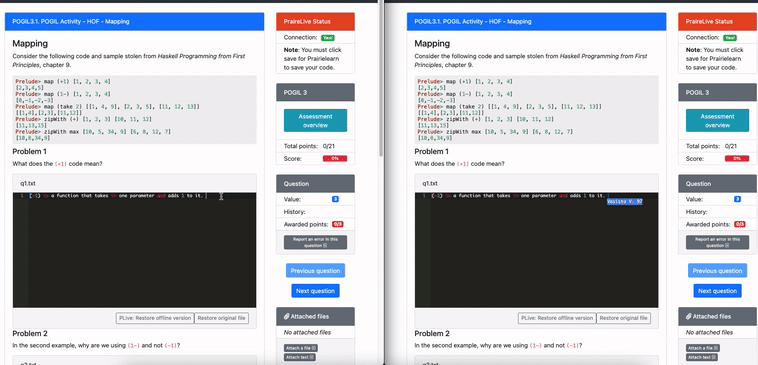
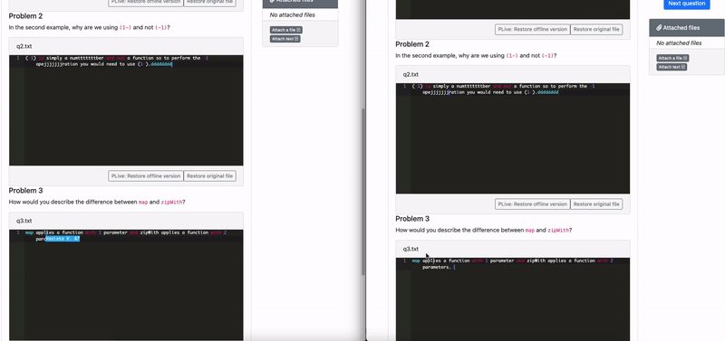

# Prairie Live

Sync [Prairielearn](https://prairielearn.org/) code boxes to the cloud, live!

If working on a Prarielearn group assignment, this extension will allow all group members to edit the text in realtime.

If working alone, this will sync your code so it isn't accidentally lost.

**Note**: This extension has only been tested on Google Chrome but seems to work perfectly fine in Firefox too.

**Note**: Live syncing will only occur between users of this extension. 

Link to Chrome Webstore Download:

https://chrome.google.com/webstore/detail/prairie-live/bfinjmepnadefebogpbmlpnhgfmhkmin

## Features

### Live Syncing Text

### Live Syncing Selections

# Installation

## Chrome Webstore
Go to https://chrome.google.com/webstore/detail/prairie-live/bfinjmepnadefebogpbmlpnhgfmhkmin

## Manual

1. Download this repo by either:

    a. cloning: `git clone https://github.com/TheTripleV/PrairieLive.git`

    b. downloaing as zip and extracting
2. Navigate to `chrome://extensions` in Google Chrome
3. Enable Developer Mode (top right corner of the page)
4. Click `Load unpacked` (top left corner of the page)
5. [Navigate to / Select] this repo